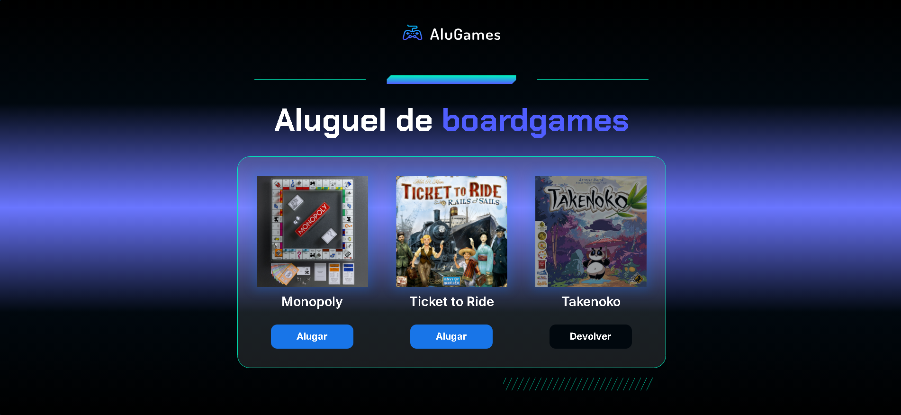

# Alugames - Simulador de Aluguel de Jogos

Este projeto é um simulador simples de aluguel e devolução de jogos, desenvolvido com JavaScript, HTML e CSS. Ele demonstra a manipulação do DOM (Document Object Model) para alterar o estado visual de elementos na página com base em interações do usuário.

## Funcionalidades

*   **Alterar Status do Jogo:** Ao clicar em um jogo, seu status visual muda entre "Alugado" e "Disponível".
*   **Feedback Visual:** A imagem do jogo e o texto do botão são atualizados para refletir o status atual (alugado/devolvido).
*   **Interatividade:** Permite ao usuário simular o processo de alugar e devolver jogos diretamente na interface.

## Como Usar

1.  Abra o arquivo `index.html` (ou o arquivo HTML principal do projeto) em seu navegador web.
2.  A interface exibirá uma lista de jogos.
3.  Clique nos botões associados a cada jogo para alternar entre os estados "Alugar" e "Devolver". Observe as mudanças visuais na imagem do jogo e no texto do botão.

## Estrutura do Projeto (Exemplo)

*   `index.html`: Contém a estrutura HTML da página, incluindo os elementos dos jogos.
*   `css/style.css`: Define os estilos visuais da aplicação, incluindo os estilos para os estados "alugado" e "disponível".
*   `js/app.js`: Contém a lógica JavaScript que gerencia a interatividade, como a função `alterarStatus`.

## Tecnologias Utilizadas

*   HTML5: Para a estrutura do conteúdo.
*   CSS3: Para a estilização e apresentação visual.
*   JavaScript: Para a lógica de interatividade e manipulação do DOM.
